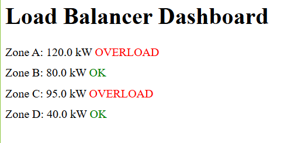
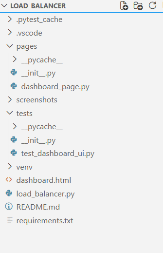

# Load Balancer Analyzer & Dashboard QA Automation

This project simulates an **industrial electrical load balancing system**, like those used in smart grids or PLC diagnostics. It includes full **backend logic** + **Selenium UI testing**.

---

## Screenshots

### Backend Terminal Output 

> Shows real-time load analysis, overload detection, and redistribution suggestions:


---

### Web Dashboard (HTML Mock UI)

> This is the simulated frontend UI tested with Selenium:



---

## What This Project Does

- Calculates **ideal electrical load** across multiple zones
- Detects **overloads** and recommends redistribution
- Generates a **report** of load status
- Serves a **mock web dashboard** (HTML)
- Uses **Selenium** to validate UI values vs backend logic

---

## Project Structure

> This is the final project structureL



---

## Requirements

- python 3.9+
- web browser
- selenium
- pytest

## How to Run the Project
1. Run the Backend Logic

This calculates load balancing diagnostics:

**python load_balancer.py** 


## Sample Output:

Zone Loads:
  - Zone A: 120.0 kW
  - Zone B: 80.0 kW
...
Recommended Adjustments:
  - Zone A: Reduce load by 36.25 kW


2️. Run the Selenium Test on the Dashboard

First, open the **dashboard.html** locally using Chrome, or let Selenium do it automatically.

Then run the UI test:

**pytest -v tests/test_dashboard_ui.py**


- Verifies that the UI displays the correct zone load values
- Verifies that overloaded zones are marked in red
- Uses Page Object pattern to simulate real-world automation

## Example Scenario

```
Input Zones (from Python logic):
sample_zones = [
    ZoneLoad("Zone A", 120.0),
    ZoneLoad("Zone B", 80.0),
    ZoneLoad("Zone C", 95.0),
    ZoneLoad("Zone D", 40.0)
]
````


**Corresponding Dashboard Output:**

Zone A: 120.0 kW – OVERLOAD (in red)

Zone B: 80.0 kW – OK (green)

## Author
**Syed Nafiz Imtiaz**

*BSc. in Electrical and Electronics Engineering*

*MASc. in Energy Systems Engineering*

Software Support Engineer | EIT Applicant | [LinkedIn](https://www.linkedin.com/in/syed-nafiz/)
